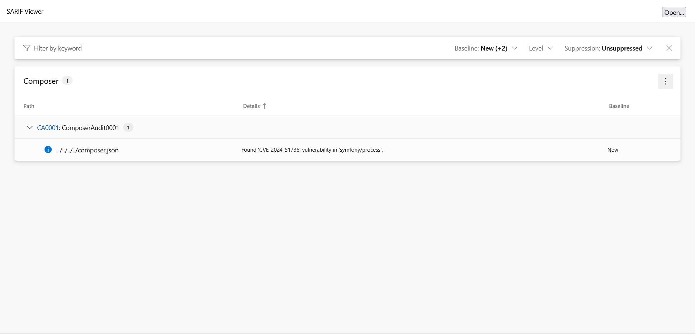

<!-- markdownlint-disable MD013 -->
# Composer Audit Converter

[](https://github.com/composer/composer)

> [!NOTE]
>
> Available since version 1.2.0

## Table Of Contents

1. [Requirements](#requirements)
2. [Installation](#installation)
3. [Usage](#usage)
4. [Learn more](#learn-more)
5. [IDE Integration](#ide-integration)
6. [Web SARIF viewer](#web-sarif-viewer)


## Requirements

* [Composer][composer] requires PHP version 7.2.5 or greater,
* This SARIF converter requires at least Composer version 2.4.0

## Installation

Without Composer greater or equal to 2.4.0

```shell
composer require --dev composer/composer bartlett/sarif-php-converters
```

With Composer greater or equal to 2.4.0

```shell
composer require --dev bartlett/sarif-php-converters
```

## Usage

> [!WARNING]
>
> As Composer is not able to load custom output format on fly without to modify the `Composer\Advisory\Auditor` class,
> we have no other alternative that using the **Console Tool** convert command.

### :material-numeric-1-box: Build the native json output report

```shell
vendor/bin/composer audit --format=json > examples/composer/audit.json
```

### :material-numeric-2-box: And finally, convert it to SARIF with the **Console Tool**

```shell
php report-converter convert composer --input-format=json --input-file=examples/composer/audit.json -v
```

> [!TIP]
>
> * Without verbose option (`-v`) the Console Tool will print a compact SARIF version.
> * `--output-file` option allows to write a copy of the report to a file. By default, the Console Tool will always print the specified report to the standard output.

## Learn more

* See demo [`examples/composer/`][example-folder] directory into this repository.

## IDE Integration

The SARIF report file `[*].sarif.json` is automagically recognized and interpreted by PhpStorm (2024).


## Web SARIF viewer

With the [React based component][sarif-web-component], you are able to explore a sarif report file previously generated.

For example:



[example-folder]: https://github.com/llaville/sarif-php-converters/blob/1.2/examples/composer/
[composer]: https://github.com/composer/composer
[sarif-web-component]: https://github.com/Microsoft/sarif-web-component
