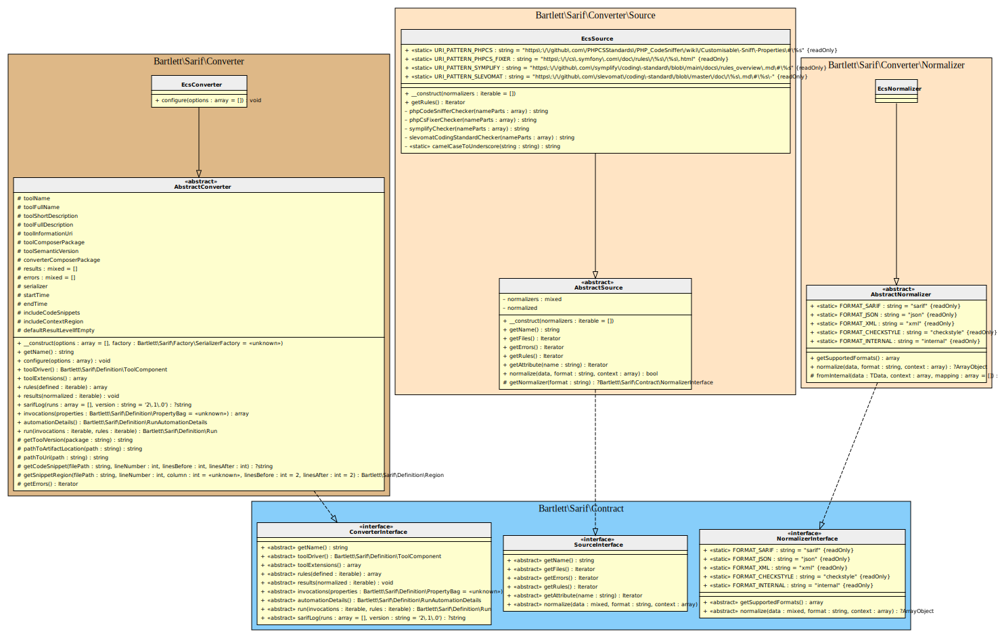

<!-- markdownlint-disable MD013 -->
# Easy-Coding-Standard Converter

[](https://github.com/easy-coding-standard/easy-coding-standard)

> [!NOTE]
>
> Available since version 1.0.0

## Table Of Contents

1. [Requirements](#requirements)
2. [Installation](#installation)
3. [Usage](#usage)
4. [Learn more](#learn-more)
5. [IDE Integration](#ide-integration)



## Requirements

* [Easy-Coding-Standard][ecs] requires PHP version 7.2.0 or greater,
* This SARIF converter requires at least Easy-Coding-Standard version 12.3.1

## Installation

```shell
composer require --dev symplify/easy-coding-standard bartlett/sarif-php-converters
```

## Usage

> [!WARNING]
>
> As Easy-Coding-Standard is not able to load custom output format on fly without to modify the `LazyContainerFactory`
> (see e.g: [add junit output formatter](https://github.com/easy-coding-standard/easy-coding-standard/pull/212)),
> we have no other alternative that using the **Console Tool** convert command.

**Step 1:** Create a basic ECS config file

For example :

```php
<?php

declare(strict_types=1);

use PhpCsFixer\Fixer\Import\NoUnusedImportsFixer;
use Symplify\EasyCodingStandard\Config\ECSConfig;

return ECSConfig::configure()
    ->withPaths([
        realpath(__DIR__ . '/examples'),
        realpath(__DIR__ . '/src'),
        realpath(__DIR__ . '/tests'),
    ])

    // Report absolute path on filenames
    ->withRealPathReporting(true)

    // add a single rule
    ->withRules([
        NoUnusedImportsFixer::class,
    ])

    // add sets - group of rules
    ->withPreparedSets(
         arrays: true,
         namespaces: true,
         spaces: true,
         docblocks: true,
         comments: true,
    )
;
```

**Step 2:** Build the native checkstyle output report

```shell
vendor/bin/ecs check --output-format=checkstyle > examples/ecs/checkstyle.xml
```

> [!WARNING]
>
> Be sure to specify absolute path to source code to analyze, otherwise the Console Tool `convert` command
> will raise some warnings about file names.
>
> Add into your `ecs.php` config file, at least the following directive (available only since version 12.3.1) :
>
> ```php
> <?php
> return ECSConfig::configure()->withRealPathReporting(true);
> ```

**Step 3:** And finally, convert it to SARIF with the **Console Tool**

```shell
php report-converter convert ecs --input-format=checkstyle --input-file=examples/ecs/checkstyle.xml -v
```

> [!TIP]
>
> * Without verbose option (`-v`) the Console Tool will print a compact SARIF version.
> * `--output-file` option allows to write a copy of the report to a file. By default, the Console Tool will always print the specified report to the standard output.

## Learn more

* See demo [`examples/ecs/`][example-folder] directory into this repository.

## IDE Integration

The SARIF report file `[*].sarif.json` is automagically recognized and interpreted by PhpStorm (2024).


[example-folder]: https://github.com/llaville/sarif-php-sdk/blob/1.0/examples/ecs/
[ecs]: https://github.com/easy-coding-standard/easy-coding-standard
