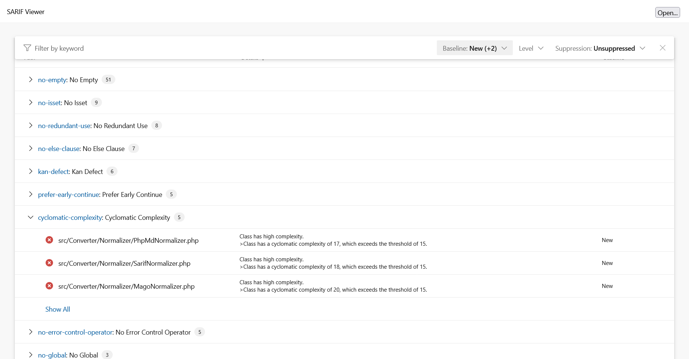

<!-- markdownlint-disable MD013 -->
# Mago Converter

[](https://github.com/carthage-software/mago)

> [!NOTE]
>
> Available since version 1.6.0

## Table Of Contents

1. [Requirements](#requirements)
2. [Installation](#installation)
3. [Usage](#usage)
4. [Learn more](#learn-more)
5. [Web SARIF viewer](#web-sarif-viewer)


## Requirements

* [Mago][mago] requires PHP version 8.1 or greater.

```json
{
    "require-dev": {
        "carthage-software/mago": "^1.25.2"
    }
}
```

## Installation

```shell
composer require --dev carthage-software/mago bartlett/sarif-php-converters
```

## Usage

> [!WARNING]
>
> As Mago 1.x is not able to specify/boot custom renderer easily,
> we have no other alternative that using the **Console Tool** convert command.

### :material-numeric-1-box: Build the gitlab output report

```shell
vendor/bin/mago lint /path/to/source --reporting-format gitlab > examples/mago/native.gitlab.json
```

### :material-numeric-2-box: And finally, convert it to SARIF with the **Console Tool**

```shell
php report-converter convert mago --input-format=gitlab --input-file=examples/mago/native.gitlab.json -v
```

> [!TIP]
>
> * Without verbose option (`-v`) the Console Tool will print a compact SARIF version.
> * `--output-file` option allows to write a copy of the report to a file. By default, the Console Tool will always print the specified report to the standard output.

Alternative :

```shell
vendor/bin/mago lint /path/to/source --reporting-format sarif > examples/mago/native.sarif.json
```

```shell
php report-converter convert mago --input-format=sarif --input-file=examples/mago/native.sarif.json -v > examples/mago/fixed-sarif.json
```

## Learn more

* See demo [`examples/mago/`][example-folder] directory into this repository.

## Web SARIF viewer

With the [React based component][sarif-web-component], you are able to explore a sarif report file previously generated.

For example:



[example-folder]: https://github.com/llaville/sarif-php-converters/blob/1.6/examples/mago/
[mago]: https://github.com/carthage-software/mago
[sarif-web-component]: https://github.com/Microsoft/sarif-web-component
