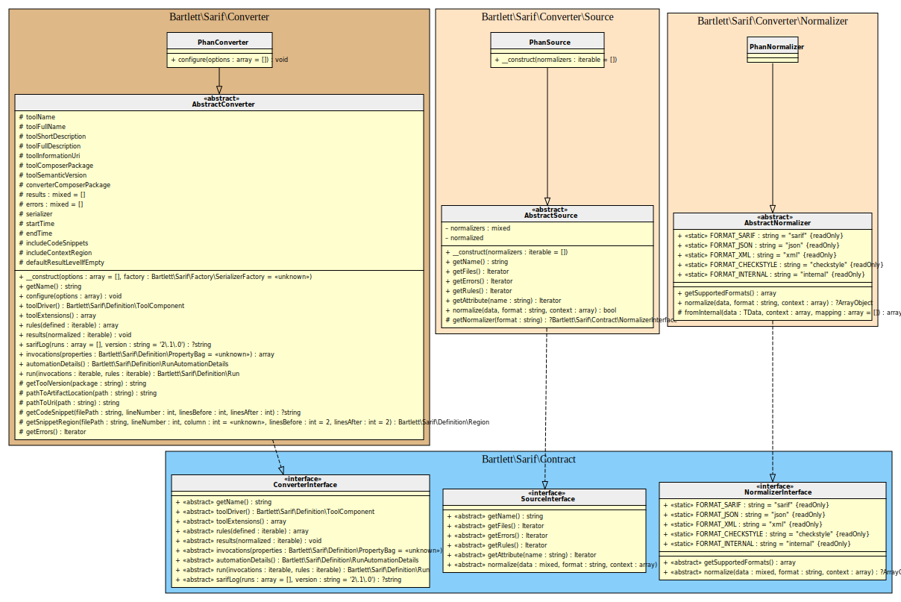

<!-- markdownlint-disable MD013 -->
# Phan Converter

[](https://github.com/phan/phan)

> [!NOTE]
>
> Available since version 1.0.0

## Table Of Contents

1. [Requirements](#requirements)
2. [Installation](#installation)
3. [Usage](#usage)
4. [Learn more](#learn-more)
5. [IDE Integration](#ide-integration)
6. [Web SARIF viewer](#web-sarif-viewer)



## Requirements

* [Phan][phan] requires PHP version 7.2.0 or greater, with `filter`, `json` and `tokenizer` extensions loaded
* This SARIF converter requires at least Phan version 5.0

## Installation

```shell
composer require --dev phan/phan bartlett/sarif-php-converters
```

## Usage

> [!WARNING]
>
> As Phan v5 is not able to specify custom printer format,
> we have no other alternative that using the **Console Tool** convert command.

### :material-numeric-1-box: Build the checkstyle output report

```shell
vendor/bin/phpan --directory /absolute/path/to/source/code --absolute-path-issue-messages --output-mode=checkstyle --output=checkstyle.xml
```

> [!WARNING]
>
> Be sure to specify `--absolute-path-issue-messages`, otherwise the Console Tool `convert` command
> will raise some warnings about file names.

### :material-numeric-2-box: And finally, convert it to SARIF with the **Console Tool**

```shell
php report-converter convert phan --input-format=checkstyle --input-file=examples/phan/checkstyle.xml -v
```

> [!TIP]
>
> * Without verbose option (`-v`) the Console Tool will print a compact SARIF version.
> * `--output-file` option allows to write a copy of the report to a file. By default, the Console Tool will always print the specified report to the standard output.

## Learn more

* See demo [`examples/phan/`][example-folder] directory into this repository.

## IDE Integration

The SARIF report file `[*].sarif.json` is automagically recognized and interpreted by PhpStorm (2024).


## Web SARIF viewer

With the [React based component][sarif-web-component], you are able to explore a sarif report file previously generated.

For example:


[example-folder]: https://github.com/llaville/sarif-php-converters/blob/1.0/examples/phan/
[phan]: https://github.com/phan/phan
[sarif-web-component]: https://github.com/Microsoft/sarif-web-component
