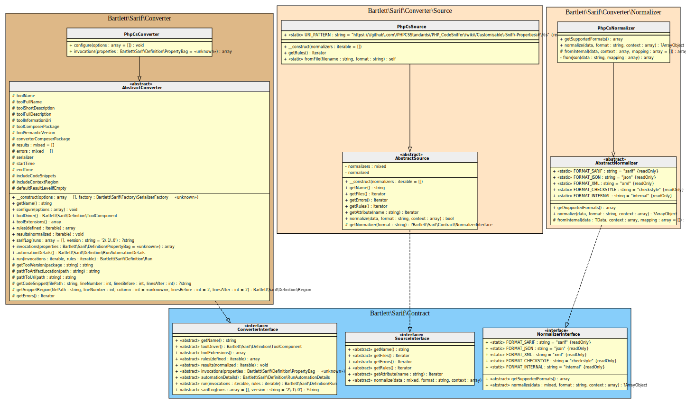

<!-- markdownlint-disable MD013 -->
# PHP_CodeSniffer Converter

[](https://github.com/PHPCSStandards/PHP_CodeSniffer)

> [!NOTE]
>
> Available since version 1.0.0

## Table Of Contents

1. [Requirements](#requirements)
2. [Installation](#installation)
3. [Usage](#usage)
4. [How to customize your converter](#how-to-customize-your-converter)
5. [Learn more](#learn-more)
6. [IDE Integration](#ide-integration)
7. [Web SARIF viewer](#web-sarif-viewer)



## Requirements

* [PHP_CodeSniffer][phpcs] requires PHP version 5.4.0 or greater, with `tokenizer`, `xmlwriter` and `simplexml` extensions loaded
* This SARIF converter requires at least PHP_CodeSniffer version 3.3.0

## Installation

```shell
composer require --dev squizlabs/php_codesniffer bartlett/sarif-php-converters
```

## Usage

```shell
vendor/bin/phpcs --standard=examples/phpcs/.phpcs.xml.dist --report-file=examples/phpcs/.sarif.json
```

> [!WARNING]
>
> If you have the following error
>
> ```text
> ERROR: Class file for report "\Bartlett\Sarif\Converter\Reporter\PhpCsReport" not found
> ```
>
> That means you've not specified the correct autoloader.
> Refer to PHP_CodeSniffer config file [autoload directive][phpcs-wiki-ruleset],

## How to customize your converter

There are many ways to customize render of your converter.

### Make the SARIF report output human-readable

By default, all converters use the default `\Bartlett\Sarif\Factory\PhpSerializerFactory`
to return the SARIF JSON representation of your report.

But this serializer factory component, as native PHP [`json_encode`][json-encode] function,
does not use whitespace in returned data to format it.

To make your report human-readable, you have to specify the `\JSON_PRETTY_PRINT` constant, as encoder option.

Here is the way to do it !

#### :material-numeric-1-box: Create your report specialized class

```php
<?php
namespace MyStandard\CS;

use Bartlett\Sarif\Converter\PhpCsConverter;
use Bartlett\Sarif\Converter\Reporter\PhpCsReport;

class MyPhpCsReport extends PhpCsReport
{
    public function __construct()
    {
         parent::__construct(new PhpCsConverter(['format_output' => true]));
   }
}
```

#### :material-numeric-2-box: And finally, print the SARIF report

```shell
vendor/bin/phpcs --report=MyPhpCsReport --standard=examples/phpcs/.phpcs.xml.dist
```

### (optional) Use the Console Tool as alternative

If you prefer to convert from a [format supported natively][phpcs-reporting] by PHPCS, then :

#### :material-numeric-1-box: Build the native [checkstyle output][phpcs-checkstyle-output] report

```shell
vendor/bin/phpcs --report=checkstyle --report-file=checkstyle.xml /path/to/source/code
```

#### :material-numeric-2-box: And finally, convert it to SARIF with the **Console Tool**

```shell
report-converter convert phpcs --input-format=checkstyle --input-file=examples/phpcs/checkstyle.xml -v
```

> [!TIP]
>
> * Without verbose option (`-v`) the Console Tool will print a compact SARIF version.
> * `--output-file` option allows to write a copy of the report to a file. By default, the Console Tool will always print the specified report to the standard output.

## Learn more

* See demo [`examples/phpcs/`][example-folder] directory into this repository.
* [Allow requesting a custom report using the report FQN][phpcs-report-fqn] PHPCS feature is available since v3.3.0

## IDE Integration

The SARIF report file `[*].sarif.json` is automagically recognized and interpreted by PhpStorm (2024).


## Web SARIF viewer

With the [React based component][sarif-web-component], you are able to explore a sarif report file previously generated.

For example:


[example-folder]: https://github.com/llaville/sarif-php-converters/blob/1.0/examples/phpcs/
[json-encode]: https://www.php.net/manual/en/function.json-encode
[phpcs]: https://github.com/PHPCSStandards/PHP_CodeSniffer
[phpcs-reporting]: https://github.com/PHPCSStandards/PHP_CodeSniffer/wiki/Reporting
[phpcs-checkstyle-output]: https://github.com/PHPCSStandards/PHP_CodeSniffer/wiki/Reporting#printing-a-checkstyle-report
[phpcs-wiki-ruleset]: https://github.com/PHPCSStandards/PHP_CodeSniffer/wiki/Annotated-Ruleset
[phpcs-report-fqn]: https://github.com/squizlabs/PHP_CodeSniffer/issues/1942
[sarif-web-component]: https://github.com/Microsoft/sarif-web-component
