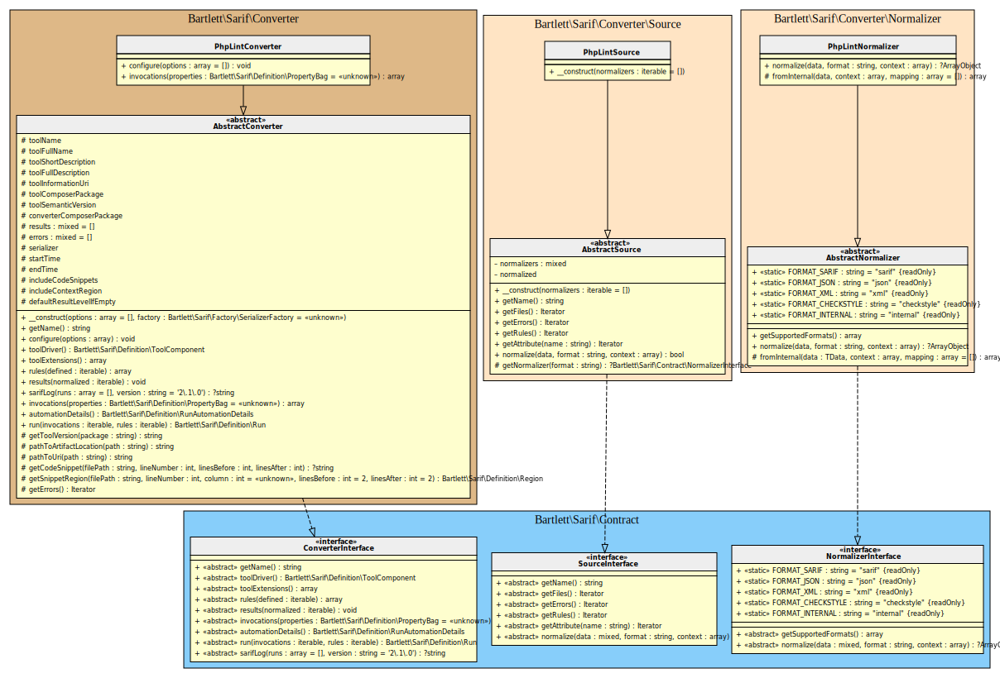

<!-- markdownlint-disable MD013 -->
# PHPLint Converter

[](https://github.com/overtrue/phplint)

> [!NOTE]
>
> Available since version 1.0.0

## Table Of Contents

1. [Requirements](#requirements)
2. [Installation](#installation)
3. [Usage](#usage)
4. [How to customize your converter](#how-to-customize-your-converter)
5. [Learn more](#learn-more)
6. [IDE Integration](#ide-integration)



## Requirements

* [PHPLint][phplint] requires PHP version 8.1.0 or greater
* This SARIF converter requires at least PHPLint version 9.4.0

## Installation

```shell
composer require --dev overtrue/phplint bartlett/sarif-php-converters
```

## Usage

```shell
vendor/bin/phplint --format='\Overtrue\PHPLint\Output\SarifOutput' /path/to/source/code
```

> [!WARNING]
>
> If you have the following error
>
> ```text
> Could not load sarif converter class: "Bartlett\Sarif\Converter\PhpLintConverter"
> ```
>
> That means you've not specified the correct autoloader.
> Please use the `--bootstrap` run option of PHPLint like that:
>
> ```vendor/bin/phplint --format='\Overtrue\PHPLint\Output\SarifOutput' --bootstrap=vendor/autoload.php```

## How to customize your converter

There are many ways to customize render of your converter.

### Make the SARIF report output human-readable

By default, all converters use the default `\Bartlett\Sarif\Factory\PhpSerializerFactory`
to return the SARIF JSON representation of your report.

But this serializer factory component, as native PHP [`json_encode`][json-encode] function,
does not use whitespace in returned data to format it.

To make your report human-readable, you have to specify the `\JSON_PRETTY_PRINT` constant, as encoder option.

Here is the way to do it !

> [!TIP]
>
> * Without verbose option (`-v`) the PHPLint `SarifOutput` will print a compact SARIF version.

**Step 1:** Prints the SARIF report

```shell
vendor/bin/phplint --format='\Overtrue\PHPLint\Output\SarifOutput' --bootstrap vendor/autoload.php --output=examples/phplint/.sarif.json -v /path/to/source/code
```

### (optional) Use the Console Tool as alternative

If you prefer to convert from a format supported natively by PHPLint, then :

**Step 1:** Build the native checkstyle output report

```shell
vendor/bin/phplint --format=checkstyle --output=checkstyle.xml /path/to/source/code
```

**Step 2:** And finally, convert it to SARIF with the **Console Tool**

```shell
report-converter convert phplint --input-format=checkstyle --input-file=examples/phplint/checkstyle.xml -v
```

> [!TIP]
>
> * Without verbose option (`-v`) the Console Tool will print a compact SARIF version.
> * `--output-file` option allows to write a copy of the report to a file. By default, the Console Tool will always print the specified report to the standard output.

## Learn more

* See demo [`examples/phplint/`][example-folder] directory into this repository.

## IDE Integration

The SARIF report file `[*].sarif.json` is automagically recognized and interpreted by PhpStorm (2024).


[example-folder]: https://github.com/llaville/sarif-php-sdk/blob/1.0/examples/phplint/
[json-encode]: https://www.php.net/manual/en/function.json-encode
[phplint]: https://github.com/overtrue/phplint
