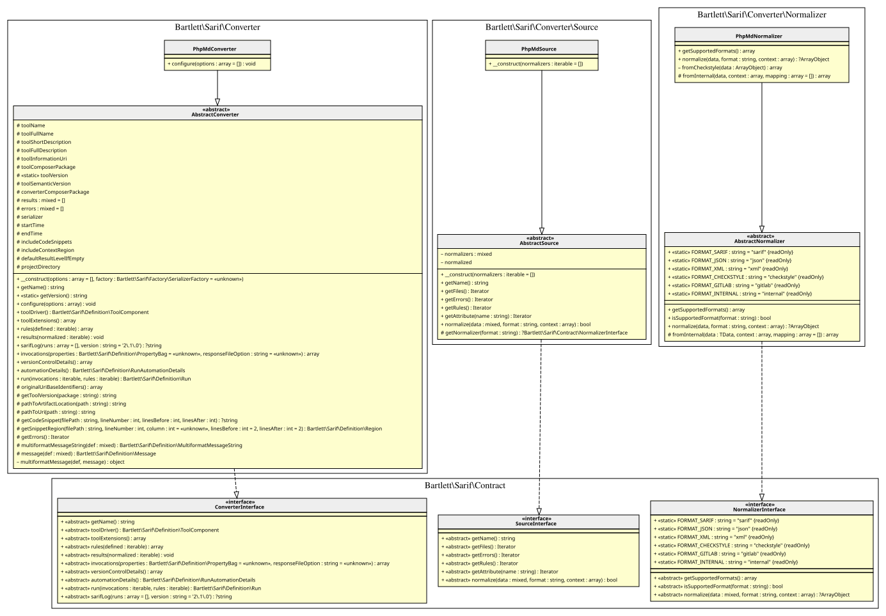
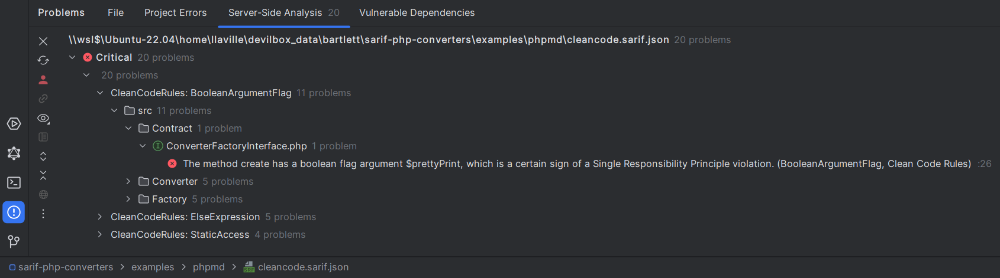
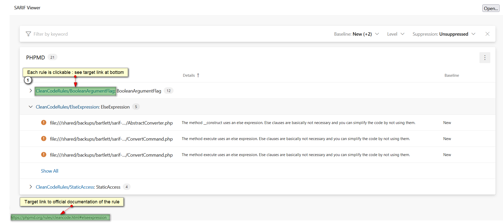

<!-- markdownlint-disable MD013 -->
# PHPMD Converter

[](https://github.com/phpmd/phpmd)

> [!NOTE]
>
> Available since version 1.0.0

## Table Of Contents

1. [Requirements](#requirements)
2. [Installation](#installation)
3. [Usage](#usage)
4. [Learn more](#learn-more)
5. [IDE Integration](#ide-integration)
6. [Web SARIF viewer](#web-sarif-viewer)



## Requirements

* [PHP Mess Detector][phpmd] version 2.0 requires PHP version 5.3.9 or greater, with `xml` extensions loaded
* [PHP Mess Detector][phpmd] version 3.0 requires PHP version 8.1 or greater, with `xml` extensions loaded

The `Bartlett\Sarif\Converter\Reporter\PhpMdRenderer` class is ready to use the new feature :
[Simplify load of external custom renderer][phpmd-bootstrap] available into PHPMD version 3.0

## Installation

```shell
composer require --dev phpmd/phpmd bartlett/sarif-php-converters
```

## Usage

> [!WARNING]
>
> - As PHMMD v2.15 is not able to specify/boot custom renderer easily,
>   we have no other alternative that using the **Console Tool** convert command.
>
> - With PHPMD v3.0 is easier. Use the alternative solution at step 3.


### :material-numeric-1-box: Build the checkstyle output report

```shell
vendor/bin/phpmd /path/to/source checkstyle ruleset --report-file=checkstyle.xml
```

### :material-numeric-2-box: And finally, convert it to SARIF with the **Console Tool**

```shell
php report-converter convert phpmd --input-format=checkstyle --input-file=examples/phpmd/checkstyle.xml -v
```

> [!TIP]
>
> * Without verbose option (`-v`) the Console Tool will print a compact SARIF version.
> * `--output-file` option allows to write a copy of the report to a file. By default, the Console Tool will always print the specified report to the standard output.

Alternative usage

### :material-numeric-3-box: Build the sarif output report directly via the default `Bartlett\Sarif\Converter\Reporter\PhpMdRenderer`

```shell
vendor/bin/phpmd analyze /path/to/source --format='\Bartlett\Sarif\Converter\Reporter\PhpMdRenderer' --bootstrap=autoload.php > sarif.json
```

> [!TIP]
>
> * Without verbose option (`-v`) the Renderer will print a compact SARIF version.

## Learn more

* See demo [`examples/phpmd/`][example-folder] directory into this repository.

## IDE Integration

The SARIF report file `[*].sarif.json` is automagically recognized and interpreted by PhpStorm (2024).



## Web SARIF viewer

With the [React based component][sarif-web-component], you are able to explore a sarif report file previously generated.

For example:



[example-folder]: https://github.com/llaville/sarif-php-converters/blob/1.0/examples/phpmd/
[phpmd]: https://github.com/phpmd/phpmd
[sarif-web-component]: https://github.com/Microsoft/sarif-web-component
[phpmd-bootstrap]: https://github.com/phpmd/phpmd/issues/1196
