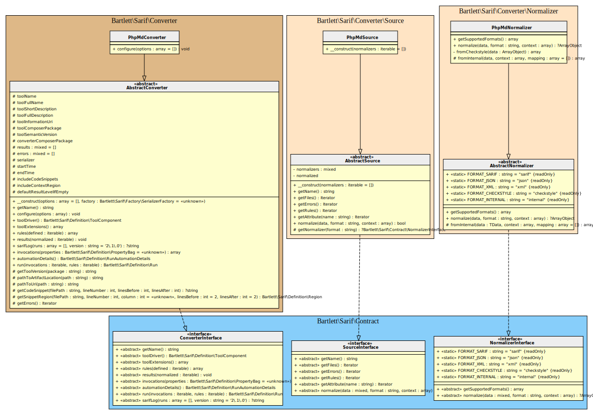

<!-- markdownlint-disable MD013 -->
# PHPMD Converter

[](https://github.com/phpmd/phpmd)

> [!NOTE]
>
> Available since version 1.0.0

## Table Of Contents

1. [Requirements](#requirements)
2. [Installation](#installation)
3. [Usage](#usage)
4. [Learn more](#learn-more)
5. [IDE Integration](#ide-integration)
6. [Web SARIF viewer](#web-sarif-viewer)



## Requirements

* [PHP Mess Detector][phpmd] requires PHP version 5.3.9 or greater, with `xml` extensions loaded
* This SARIF converter requires at least PHPMD version 2.0, but version 3.0 is highly recommended.

Version 3.x is still under development,
but the `\Bartlett\Sarif\Converter\Reporter\PhpMdRenderer` class is ready to use new feature
([Simplify load of external custom renderer][phpmd-bootstrap]).

Until this feature is GA into official PHPMD repository, you can use such `composer.json` requirements

```json
{
    "repositories": [
        {
            "type": "vcs",
            "url": "https://github.com/llaville/phpmd"
        }
    ],
    "minimum-stability": "dev",
    "require-dev": {
        "phpmd/phpmd": "dev-feature/3.x-custom-renderer as 3.x-dev"
    }
}
```

## Installation

```shell
composer require --dev phpmd/phpmd bartlett/sarif-php-converters
```

## Usage

> [!WARNING]
>
> As PHMMD v2.15 is not able to specify/boot custom renderer easily,
> we have no other alternative that using the **Console Tool** convert command.

**Step 1:** Build the checkstyle output report

```shell
vendor/bin/phpmd /path/to/source checkstyle ruleset --report-file=checkstyle.xml
```

**Step 2:** And finally, convert it to SARIF with the **Console Tool**

```shell
php report-converter convert phpmd --input-format=checkstyle --input-file=examples/phpmd/checkstyle.xml -v
```

> [!TIP]
>
> * Without verbose option (`-v`) the Console Tool will print a compact SARIF version.
> * `--output-file` option allows to write a copy of the report to a file. By default, the Console Tool will always print the specified report to the standard output.

## Learn more

* See demo [`examples/phpmd/`][example-folder] directory into this repository.

## IDE Integration

The SARIF report file `[*].sarif.json` is automagically recognized and interpreted by PhpStorm (2024).


## Web SARIF viewer

With the [React based component][sarif-web-component], you are able to explore a sarif report file previously generated.

For example:


[example-folder]: https://github.com/llaville/sarif-php-sdk/blob/1.0/examples/phpmd/
[phpmd]: https://github.com/phpmd/phpmd
[sarif-web-component]: https://github.com/Microsoft/sarif-web-component
[phpmd-bootstrap]: https://github.com/phpmd/phpmd/issues/1196
