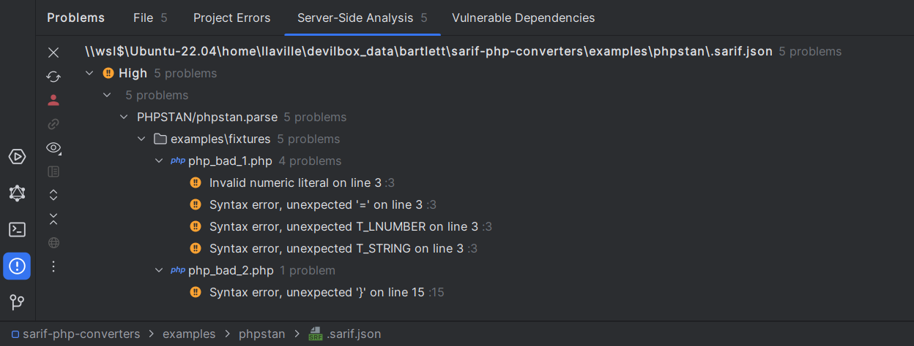

<!-- markdownlint-disable MD013 -->
# PHPStan Converter

[](https://github.com/phpstan/phpstan)

> [!NOTE]
>
> Available since version 1.0.0

## Table Of Contents

1. [Requirements](#requirements)
2. [Installation](#installation)
3. [Usage](#usage)
4. [How to customize your converter](#how-to-customize-your-converter)
5. [Learn more](#learn-more)
6. [IDE Integration](#ide-integration)


## Requirements

* [PHPStan][phpstan] requires PHP version 7.2.0 or greater
* This SARIF converter requires at least PHPStan version 1.9.0

## Installation

```shell
composer require --dev phpstan/phpstan bartlett/sarif-php-converters
```

Then update your `phpstan.neon.dist` configuration file:

```yaml
services:
    errorFormatter.sarif:
        class: Bartlett\Sarif\Converter\Reporter\PhpStanFormatter
```

## Usage

```shell
vendor/bin/phpstan analyse --error-format sarif --configuration phpstan.neon.dist --autoload-file bootstrap.php
```

## How to customize your converter

There are many ways to customize render of your converter.

### Make the SARIF report output human-readable

By default, all converters use the default `\Bartlett\Sarif\Factory\PhpSerializerFactory`
to return the SARIF JSON representation of your report.

But this serializer factory component, as native PHP [`json_encode`][json-encode] function,
does not use whitespace in returned data to format it.

To make your report human-readable, you have to specify the `\JSON_PRETTY_PRINT` constant, as encoder option.

Here is the way to do it !

**Step 1:** Create your formatter specialized class :

```php
<?php

use Bartlett\Sarif\Converter\PhpStanConverter;
use Bartlett\Sarif\Converter\Reporter\PhpStanFormatter;

class MySarifFormatter extends PhpStanFormatter
{
    public function __construct(bool $prettyPrint)
    {
        parent::__construct(new PhpStanConverter(null , $prettyPrint));
    }
}
```

**Step 2:** Create your own class loader to register custom serializer and converter (if any)

```php
<?php
require_once dirname(__DIR__, 2) . '/vendor/autoload.php';
require_once __DIR__ . '/MySarifFormatter.php';
```

**Step 3:** Then update your `phpstan.neon` configuration file:

```yaml
services:
    errorFormatter.sarif:
        class: MySarifFormatter
        arguments:
            prettyPrint: true
```

**Step 4:** And finally, print the SARIF report

```shell
vendor/bin/phpstan analyse --error-format sarif --configuration phpstan.neon --autoload-file bootstrap.php
```

## Learn more

* See demo [`examples/phpstan/`][example-folder] directory into repository.

## IDE Integration

The SARIF report file `[*].sarif.json` is automagically recognized and interpreted by PhpStorm (2024).



[example-folder]: https://github.com/llaville/sarif-php-converters/blob/1.0/examples/phpstan/
[json-encode]: https://www.php.net/manual/en/function.json-encode
[phpstan]: https://github.com/phpstan/phpstan
