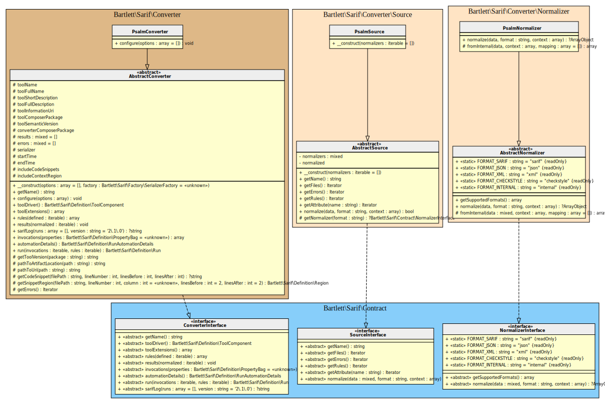
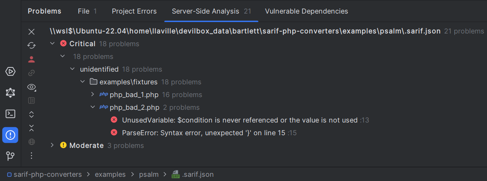
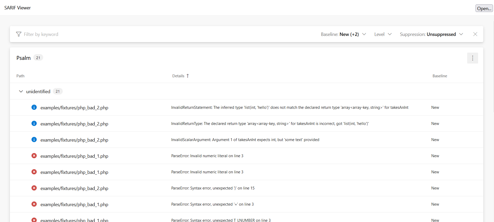

<!-- markdownlint-disable MD013 -->
# Psalm Converter

[](https://github.com/vimeo/psalm)

> [!NOTE]
>
> Available since version 1.0.0

## Table Of Contents

1. [Requirements](#requirements)
2. [Installation](#installation)
3. [Usage](#usage)
4. [Learn more](#learn-more)
5. [IDE Integration](#ide-integration)
6. [Web SARIF viewer](#web-sarif-viewer)



## Requirements

* [Psalm][psalm] requires PHP version 7.4.0 or greater, with `json`, `dom`, `ctype`, `mbstring`, `tokenizer`, `libxml` and `simplexml` extensions loaded
* This SARIF converter requires at least Psalm version 5.0

Until [introduces absolutePathReporting configuration setting][psalm-absolute-path-reporting] is accepted and included into one official Psalm v5 release,
you can use such `composer.json` requirements :

```json
{
    "repositories": [
        {
            "type": "vcs",
            "url": "https://github.com/llaville/psalm"
        }
    ],
    "minimum-stability": "dev",
    "require-dev": {
        "vimeo/psalm": "dev-reporting-with-absolute-path as 5.x-dev"
    }
}
```

## Installation

```shell
composer require --dev vimeo/psalm bartlett/sarif-php-converters
```

## Usage

> [!WARNING]
>
> As Psalm v5 is not able to specify/boot custom renderer easily,
> we have no other alternative that using the **Console Tool** convert command.

**Step 1:** Initialize Psalm configuration file `psalm.xml`

```shell
vendor/bin/psalm path/to/source --init
```

> [!WARNING]
>
> Be sure to specify absolute path reporting (`absolutePathReporting="true"`) into `psalm.xml` config file,
> otherwise the Console Tool `convert` command will raise some warnings about file names.

**Step 2:** Build the checkstyle output report

```shell
vendor/bin/psalm --report=psalm.checkstyle.xml
```

**Step 3:** And finally, convert it to SARIF normalized with the **Console Tool**

```shell
php report-converter convert psalm --input-format=checkstyle --input-file=examples/psalm/psalm.checkstyle.xml -v
```

> [!TIP]
>
> * Without verbose option (`-v`) the Console Tool will print a compact SARIF version.
> * `--output-file` option allows to write a copy of the report to a file. By default, the Console Tool will always print the specified report to the standard output.

## Learn more

* See demo [`examples/psalm/`][example-folder] directory into this repository.

## IDE Integration

The SARIF report file `[*].sarif.json` is automagically recognized and interpreted by PhpStorm (2024).



## Web SARIF viewer

With the [React based component][sarif-web-component], you are able to explore a sarif report file previously generated.

For example:



[example-folder]: https://github.com/llaville/sarif-php-converters/blob/1.0/examples/psalm/
[psalm]: https://github.com/vimeo/psalm
[sarif-web-component]: https://github.com/Microsoft/sarif-web-component
[psalm-absolute-path-reporting]: https://github.com/vimeo/psalm/pull/11049
