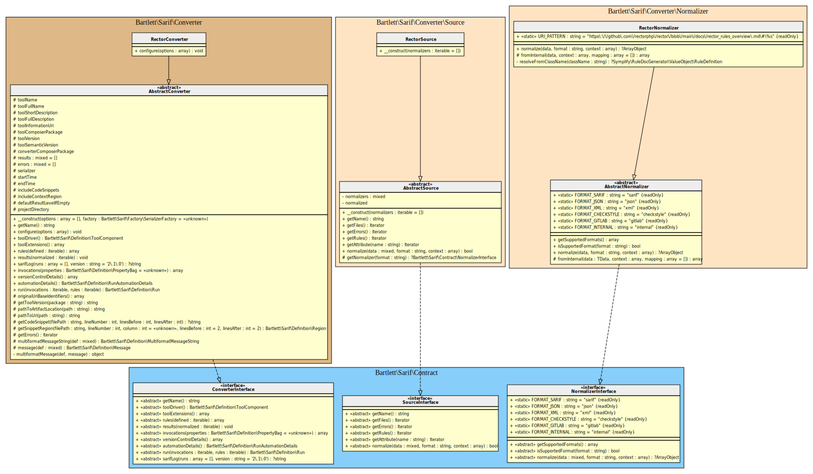
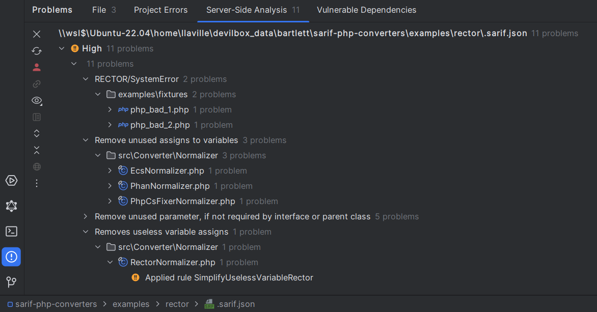

<!-- markdownlint-disable MD013 -->
# Rector Converter

[](https://github.com/rectorphp/rector)

> [!NOTE]
>
> Available since version 1.0.0

## Table Of Contents

1. [Requirements](#requirements)
2. [Installation](#installation)
3. [Usage](#usage)
4. [How to customize your converter](#how-to-customize-your-converter)
5. [Learn more](#learn-more)
6. [IDE Integration](#ide-integration)
7. [Web SARIF viewer](#web-sarif-viewer)



## Requirements

* [Rector][rector] requires PHP version 7.4.0 or greater, with `phpstan` 2.0 or greater
* This SARIF converter requires at least Rector version 2.0

## Installation

```shell
composer require --dev rector/rector bartlett/sarif-php-converters
```

## Usage

### :material-numeric-1-box: Update your `rector.php` configuration file

Register at least the `RectorFormatter` service to be able to specify `--output-format sarif` with rector command.

```php
<?php
use Bartlett\Sarif\Converter\Reporter\RectorFormatter;

use Rector\ChangesReporting\Contract\Output\OutputFormatterInterface;
use Rector\Config\RectorConfig;

return RectorConfig::configure()
    ->withPaths([
        __DIR__ . '/src',
    ])
    ->withPreparedSets(true)
    ->withRealPathReporting()
    ->withBootstrapFiles([__DIR__ . '/../../vendor/autoload.php']) // loader for Sarif PHP Converters classes
    ->registerService(RectorFormatter::class, null, OutputFormatterInterface::class)
;
```

### :material-numeric-2-box: Then print the SARIF report

```shell
vendor/bin/rector process --dry-run  --output-format sarif --config /path/to/rector.php > .sarif.json
```

> [!WARNING]
>
> Be sure to specify `withRealPathReporting`, otherwise the Console Tool `convert` command
> will raise some warnings about file names.
> Requires at least [feature](https://github.com/rectorphp/rector/issues/8757) is implemented in a future Rector release.

## How to customize your converter

There are many ways to customize render of your converter.

### Make the SARIF report output human-readable

By default, all converters use the default `\Bartlett\Sarif\Factory\PhpSerializerFactory`
to return the SARIF JSON representation of your report.

But this serializer factory component, as native PHP [`json_encode`][json-encode] function,
does not use whitespace in returned data to format it.

To make your report human-readable, you have to specify the `\JSON_PRETTY_PRINT` constant, as encoder option.

Here is the way to do it !

#### :material-numeric-1-box: Create your formatter specialized class

```php
<?php

use Bartlett\Sarif\Converter\RectorConverter;
use Bartlett\Sarif\Converter\Reporter\RectorFormatter;

class MySarifFormatter extends RectorFormatter
{
    public function __construct()
    {
        parent::__construct(
            new RectorConverter(
                [
                    'format_output' => true,
                ]
            )
        );
    }
}
```

#### :material-numeric-2-box: Create your own class loader to register custom converter

```php
<?php
require_once dirname(__DIR__, 2) . '/vendor/autoload.php';
require_once __DIR__ . '/MySarifFormatter.php';
```

#### :material-numeric-3-box: Then update your `rector.php` configuration file

```php
<?php
use Bartlett\Sarif\Converter\Reporter\RectorFormatter;

use Rector\ChangesReporting\Contract\Output\OutputFormatterInterface;
use Rector\Config\RectorConfig;

return RectorConfig::configure()
    ->withPaths([
        __DIR__ . '/src',
    ])
    ->withPreparedSets(true)
    ->withRealPathReporting()
    ->withBootstrapFiles([__DIR__ . '/../../vendor/autoload.php']) // loader for Sarif PHP Converters classes
    ->registerService(MySarifFormatter::class, null, OutputFormatterInterface::class)
;
```

### :material-numeric-4-box: And finally, print the SARIF report

```shell
vendor/bin/rector process --dry-run  --output-format sarif --config /path/to/rector.php --autoload-file /path/to/bootstrap.php > .sarif.json
```

## Learn more

* See demo [`examples/rector/`][example-folder] directory into this repository.

## IDE Integration

The SARIF report file `[*].sarif.json` is automagically recognized and interpreted by PhpStorm (2024).



## Web SARIF viewer

With the [React based component][sarif-web-component], you are able to explore a sarif report file previously generated.

For example:


[example-folder]: https://github.com/llaville/sarif-php-converters/blob/1.0/examples/rector/
[rector]: https://github.com/rectorphp/rector
[sarif-web-component]: https://github.com/Microsoft/sarif-web-component
