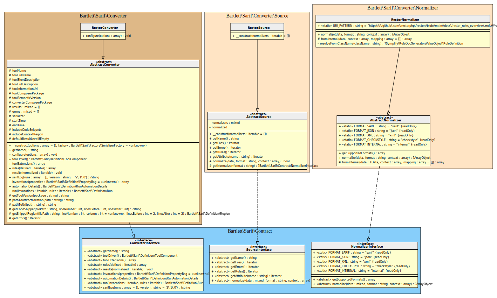

<!-- markdownlint-disable MD013 -->
# Rector Converter

[](https://github.com/rectorphp/rector)

> [!NOTE]
>
> Available since version 1.0.0

## Table Of Contents

1. [Requirements](#requirements)
2. [Installation](#installation)
3. [Usage](#usage)
4. [Learn more](#learn-more)
5. [IDE Integration](#ide-integration)
6. [Web SARIF viewer](#web-sarif-viewer)



## Requirements

* [Rector][rector] requires PHP version 7.2.0 or greater, with `phpstan` 1.11 or greater
* This SARIF converter requires at least Rector version 1.0

## Installation

```shell
composer require --dev rector/rector bartlett/sarif-php-converters
```

## Usage

**Step 1:** Update your `rector.php` configuration file

Register at least the `RectorFormatter` service to be able to specify `--output-format sarif` with rector command.

```php
<?php
use Bartlett\Sarif\Converter\Reporter\RectorFormatter;

use Rector\ChangesReporting\Contract\Output\OutputFormatterInterface;
use Rector\Config\RectorConfig;

return RectorConfig::configure()
    ->withPaths([
        __DIR__ . '/src',
    ])
    ->withPreparedSets(true)
    ->withRealPathReporting()
    ->withBootstrapFiles([__DIR__ . '/../../vendor/autoload.php']) // loader for Sarif PHP Converters classes
    ->registerService(RectorFormatter::class, null, OutputFormatterInterface::class)
;
```

**Step 2:** Then print the SARIF report

```shell
vendor/bin/rector process --dry-run  --output-format sarif --config /path/to/rector.php > .sarif.json
```

> [!WARNING]
>
> Be sure to specify `withRealPathReporting`, otherwise the Console Tool `convert` command
> will raise some warnings about file names.
> Requires at least [feature](https://github.com/rectorphp/rector/issues/8757) is implemented in a future Rector release.

## Learn more

* See demo [`examples/rector/`][example-folder] directory into this repository.

## IDE Integration

The SARIF report file `[*].sarif.json` is automagically recognized and interpreted by PhpStorm (2024).


## Web SARIF viewer

With the [React based component][sarif-web-component], you are able to explore a sarif report file previously generated.

For example:


[example-folder]: https://github.com/llaville/sarif-php-converters/blob/1.0/examples/rector/
[rector]: https://github.com/rectorphp/rector
[sarif-web-component]: https://github.com/Microsoft/sarif-web-component
