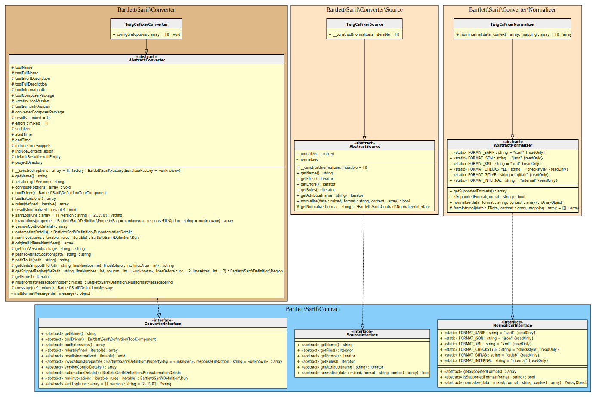
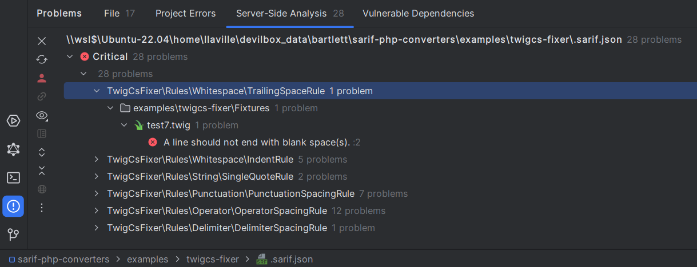
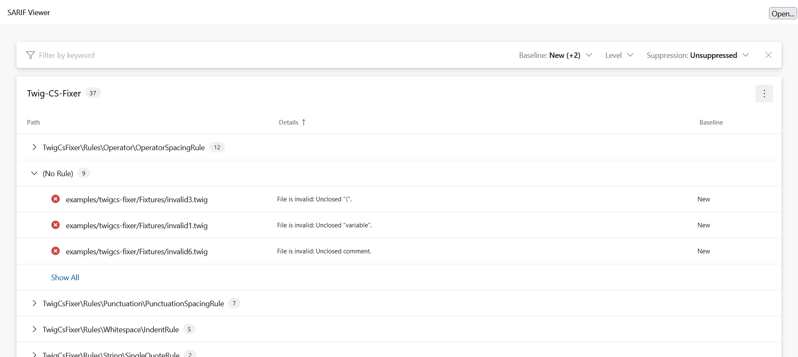

<!-- markdownlint-disable MD013 -->
# Twig-CS-Fixer Converter

[](https://github.com/VincentLanglet/Twig-CS-Fixer)

> [!NOTE]
>
> Available since version 1.0.0

## Table Of Contents

1. [Requirements](#requirements)
2. [Installation](#installation)
3. [Usage](#usage)
4. [Learn more](#learn-more)
5. [IDE Integration](#ide-integration)
6. [Web SARIF viewer](#web-sarif-viewer)



## Requirements

* [Twig-CS-Fixer][twigcs-fixer] requires PHP version 8.0 or greater, with `ctype` and `json` extensions loaded
* This SARIF converter requires at least Twig-CS-Fixer version 3.0.0

## Installation

```shell
composer require --dev vincentlanglet/twig-cs-fixer bartlett/sarif-php-converters
```

## Usage

```shell
vendor/bin/twig-cs-fixer lint /path/to/source --report sarif --config .twig-cs-fixer.dist.php
```

> [!TIP]
>
> The `.twig-cs-fixer.dist.php` config file should at least identify the default Custom Reporter class `TwigCsFixerReporter`
>
> ```php
> $config = new TwigCsFixer\Config\Config();
> $config->addCustomReporter(new Bartlett\Sarif\Converter\Reporter\TwigCsFixerReporter());
> ```
>
## How to customize your converter

There are many ways to customize render of your converter.

### Make the SARIF report output human-readable

By default, all converters use the default `\Bartlett\Sarif\Factory\PhpSerializerFactory`
to return the SARIF JSON representation of your report.

But this serializer factory component, as native PHP [`json_encode`][json-encode] function,
does not use whitespace in returned data to format it.

To make your report human-readable, you have to specify the `\JSON_PRETTY_PRINT` constant, as encoder option.

Here is the way to do it !

**Step 1:** Create your report specialized class :

```php
<?php

use Bartlett\Sarif\Converter\Reporter\TwigCsFixerReporter;
use Bartlett\Sarif\Converter\TwigCsFixerConverter;

class MyTwigCsFixerReporter extends TwigCsFixerReporter
{
    public function __construct()
    {
        // enable pretty print feature
        parent::__construct(
            new TwigCsFixerConverter([
                'format_output' => true,
            ])
        );
    }
}
```

**Step 2:** And finally, print the SARIF report

```shell
vendor/bin/twig-cs-fixer lint /path/to/source --report sarif --config .twig-cs-fixer.php
```

> [!TIP]
>
> The `MyTwigCsFixerReporter` class is identified by the `.twig-cs-fixer.php` config file.

### (optional) Use the Console Tool as alternative

If you prefer to convert from a [format supported natively][[twigcs-fixer-custom-reporters]] by Twig-CS-Fixer, then :

**Step 1:** Build the checkstyle output report

```shell
vendor/bin/twig-cs-fixer lint /path/to/source --report checkstyle
```

**Step 2:** And finally, convert it to SARIF with the **Console Tool**

```shell
php report-converter convert twigcs-fixer --input-format=checkstyle --input-file=examples/twigcs-fixer/checkstyle.xml -v
```

> [!TIP]
>
> * Without verbose option (`-v`) the Console Tool will print a compact SARIF version.
> * `--output-file` option allows to write a copy of the report to a file. By default, the Console Tool will always print the specified report to the standard output.

## Learn more

* See demo [`examples/twigcs-fixer/`][example-folder] directory into this repository.

## IDE Integration

The SARIF report file `[*].sarif.json` is automagically recognized and interpreted by PhpStorm (2024).



## Web SARIF viewer

With the [React based component][sarif-web-component], you are able to explore a sarif report file previously generated.

For example:



[example-folder]: https://github.com/llaville/sarif-php-sdk/blob/1.0/examples/twigcs-fixer/
[json-encode]: https://www.php.net/manual/en/function.json-encode
[twigcs-fixer]: https://github.com/VincentLanglet/Twig-CS-Fixer
[sarif-web-component]: https://github.com/Microsoft/sarif-web-component
[twigcs-fixer-custom-reporters]: https://github.com/VincentLanglet/Twig-CS-Fixer/blob/main/docs/configuration.md#custom-reporters
