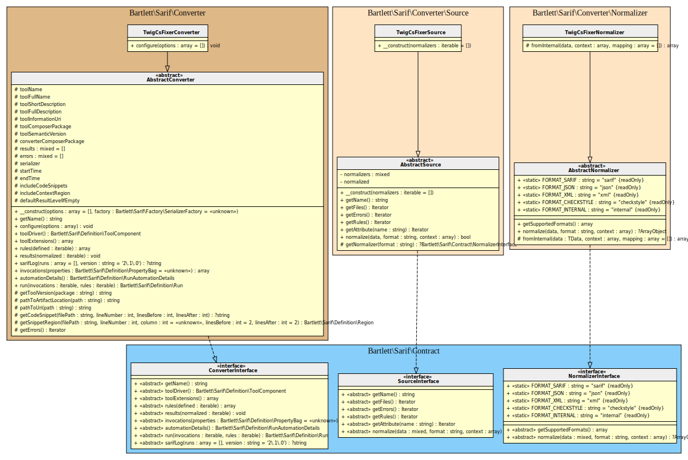

<!-- markdownlint-disable MD013 -->
# Twig-CS-Fixer Converter

[](https://github.com/VincentLanglet/Twig-CS-Fixer)

> [!NOTE]
>
> Available since version 1.0.0

## Table Of Contents

1. [Requirements](#requirements)
2. [Installation](#installation)
3. [Usage](#usage)
4. [Learn more](#learn-more)
5. [IDE Integration](#ide-integration)
6. [Web SARIF viewer](#web-sarif-viewer)



## Requirements

* [Twig-CS-Fixer][twigcs-fixer] requires PHP version 8.0 or greater, with `ctype` and `json` extensions loaded
* This SARIF converter requires at least Twig-CS-Fixer version 3.0.0

## Installation

```shell
composer require --dev vincentlanglet/twig-cs-fixer bartlett/sarif-php-converters
```

## Usage

> [!WARNING]
>
> As Twig-CS-Fixer is not able to specify custom report format,
> we have no other alternative that using the **Console Tool** convert command.

**Step 1:** Build the checkstyle output report

```shell
vendor/bin/twigcs-fixer lint /path/to/source --report checkstyle
```

**Step 2:** And finally, convert it to SARIF with the **Console Tool**

```shell
php report-converter convert twigcs-fixer --input-format=checkstyle --input-file=examples/twigcs-fixer/checkstyle.xml -v
```

> [!TIP]
>
> * Without verbose option (`-v`) the Console Tool will print a compact SARIF version.
> * `--output-file` option allows to write a copy of the report to a file. By default, the Console Tool will always print the specified report to the standard output.

## Learn more

* See demo [`examples/twigcs-fixer/`][example-folder] directory into this repository.

## IDE Integration

The SARIF report file `[*].sarif.json` is automagically recognized and interpreted by PhpStorm (2024).


## Web SARIF viewer

With the [React based component][sarif-web-component], you are able to explore a sarif report file previously generated.

For example:


[example-folder]: https://github.com/llaville/sarif-php-sdk/blob/1.0/examples/twigcs-fixer/
[twigcs-fixer]: https://github.com/VincentLanglet/Twig-CS-Fixer
[sarif-web-component]: https://github.com/Microsoft/sarif-web-component
